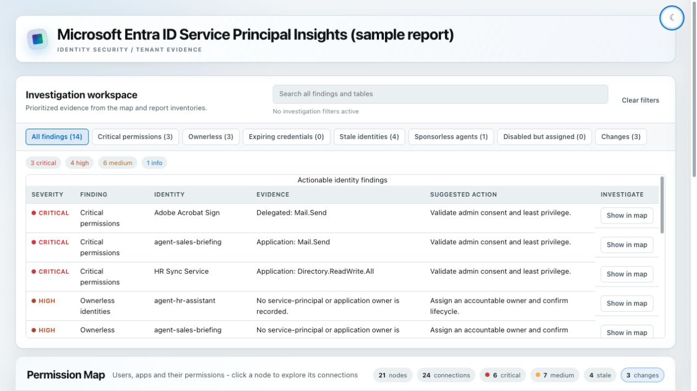
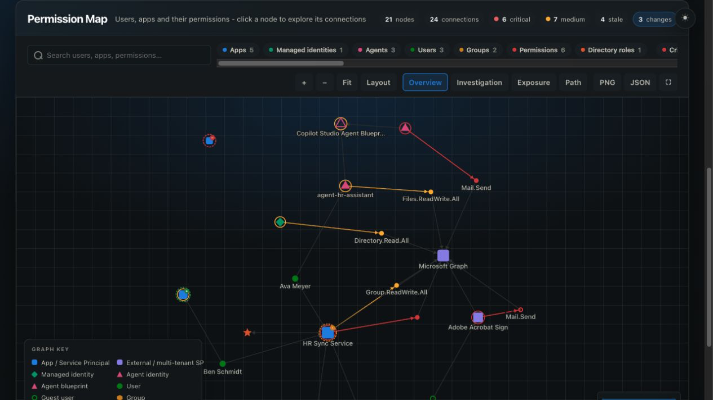
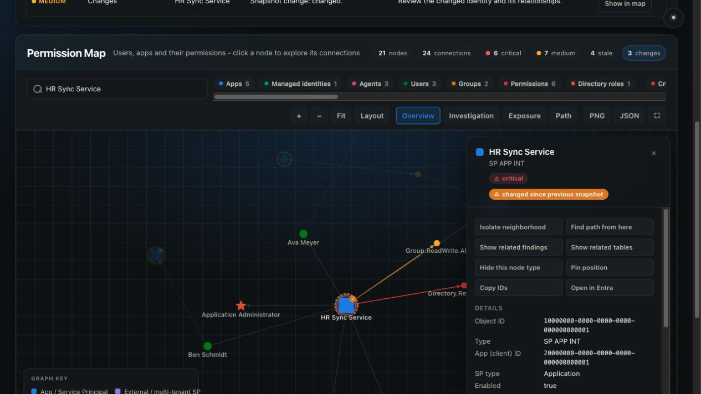
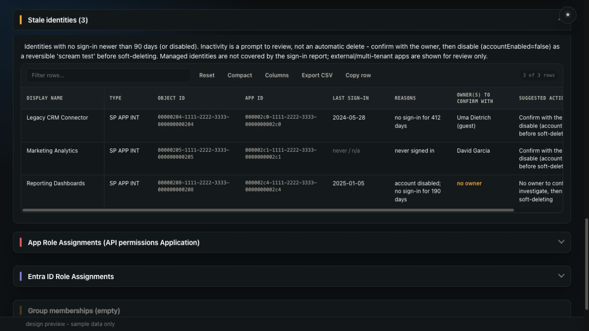

__EntraAppMap__

> **Note:** This tool is a fork of [AzADServicePrincipalInsights (aka AzADSPI)](https://github.com/JulianHayward/AzADServicePrincipalInsights) by [Julian Hayward](https://github.com/JulianHayward). It builds on AzADSPI's data collection and reporting foundation and adds an interactive Permission Map and a redesigned report. All credit for the original tool goes to Julian Hayward.

Insights and change tracking on Microsoft Entra ID Service Principals (Enterprise Applications, Applications / Managed Identities) - with an interactive Permission Map of users, apps and their permissions.

# Content
- [Content](#content)
- [Features](#features)
- [Parameters](#parameters)
- [Data](#data)
- [Prerequisites](#prerequisites)
  - [Permissions](#permissions)
    - [Azure](#azure)
    - [Microsoft Entra ID](#microsoft-entra-id)
    - [Azure DevOps](#azure-devops)
  - [PowerShell](#powershell)
- [Execute as Service Principal / Application](#execute-as-service-principal--application)
- [Preview](#preview)
- [Updates](#updates)
- [Credits & Closing Note](#credits--closing-note)


# Features

* Interactive Permission Map (embedded at the top of the HTML report)
  * Force-directed, zoomable map of users, apps / Service Principals, Managed Identities, groups, permissions and Entra ID directory roles - pan, zoom, drag, click a node to explore its connections in a details panel
  * Permissions are colored by classification (critical / medium, driven by permissionClassification.json); risky identities get a colored risk ring
  * Search, node type and risk filters, 'hide unconnected' filter, legend, fullscreen mode
  * Investigation workspace: overview, one/two-hop identity investigation and layered exposure lenses; relationship filters; low-risk external SP aggregation; contextual node actions; map-to-table navigation
  * Path finding: click 'Path', pick two nodes and the shortest connection is highlighted with each hop explained (e.g. how a guest user reaches Mail.ReadWrite)
  * Findings and table workspace: cross-report search, risk/change presets, actionable evidence rows, consistent table controls, row detail drawer and bidirectional table/map focus
  * Change lens: automatically compares with the latest prior local JSON state (or an explicit `PreviousStatePath`) and highlights added/changed identities while reporting removals
  * Deep links: selecting a node updates the URL (#map=...) so a view of a specific identity can be shared; opening the link selects and zooms to that node
  * Export the current (filtered) view as PNG image or JSON (nodes/edges)
  * Fully self-contained - no external JavaScript libraries, works in air-gapped environments
  * Related parameters: `NoPermissionMap`, `MapIncludeUnclassifiedPermissions`, `MapAssignedToEdgeLimit`
* Sign-in activity &amp; stale identity detection
  * Collects service principal sign-in activity (last sign-in, split by app-only/delegated and client/resource) for app registrations, enterprise apps and agent identities
  * New 'Stale identities' report section flags identities with no sign-in newer than the threshold (default 90 days), disabled accounts and never-used registrations - each with the reason, the owner(s) to confirm with and a suggested action (confirm &rarr; disable &rarr; soft-delete)
  * Mirrors Microsoft's 'Remove unused applications' logic: exempts freshly created apps, treats external/multi-tenant apps as review-only, and excludes managed identities from sign-in based staleness (not covered by the report)
  * On the Permission Map: a 'Stale only' filter, a stale callout with last sign-in and reasons in the details panel
  * Requires the Microsoft Graph application permission `AuditLog.Read.All`; the underlying report is beta and available in the global cloud only - without it the report still builds (disabled accounts are still flagged)
  * Related parameters: `NoStaleIdentityDetection`, `StaleIdentityDays`
* Microsoft Entra Agent ID coverage (AI agent identities)
  * Agent identities and agent identity blueprint principals are detected and typed (`SP Agent`, `SP Agent Blueprint`)
  * Dedicated 'Agent identities' report section: blueprint relationship, sponsors (the accountable humans) and classified permission counts per agent
  * Agents appear on the Permission Map as magenta triangles with 'instance of blueprint' and sponsor relationships; agent identities without a sponsor are flagged as a governance gap
  * Sponsor collection requires the optional Microsoft Graph application permission `AgentIdentity.ReadWrite.All` - without it the report still builds, just without sponsor information
* Modern report design
  * Self-contained stylesheet (no external CSS dependency), light and dark theme with toggle (persisted) and OS preference detection
  * For offline design iteration see [dev/README.md](dev/README.md)
* HTML export
* JSON export
  * Ingest data from the JSON files to an Azure Log Analytics workspace custom table using data collection rule / data collection endpoint. [Microsoft Entra Workload ID - Advanced Detections and Enrichment in Microsoft Sentinel](https://www.cloud-architekt.net/entra-workload-id-advanced-detection-enrichment/)
* CSV export (wip)
  * AADRoleAssignments
  * AppRoleAssignments
  * Oauth2PermissionGrants
  * AppSecrets
  * AppCertificates
  * AppFederatedIdentityCredentials
  * MIFederatedIdentityCredentials
  * MI User Assigned associated resources
* Customizable permission classification (permissionClassification.json)
  * sources/resources
    * https://m365internals.com/2021/07/24/everything-about-service-principals-applications-and-api-permissions/ -> What applications are considered critical?
    * https://docs.microsoft.com/en-us/security/compass/incident-response-playbook-app-consent#classifying-risky-permissions -> Classifying risky permissions   
    * https://www.youtube.com/watch?v=T-ZnAUt1IP8 -> Monitoring and Incident Response in Azure AD

# Parameters

* `DebugAzAPICall` - Switch to enable AzAPICall debug function for troubleshooting API calls using the AzAPICall module
* `ManagementGroupId` 
   * Option1: The Management Group ID that should be queried for the report. If undefined the Root Management group will be used.
   * Option2: accepts multiple Management Groups in form of an array e.g. .\pwsh\AzADServicePrincipalInsights.ps1 -ManagementGroupId @('mgId0', 'mgId1')
* `NoCsvExport`  - Switch to disable exporting enriched data in CSV format
* `CsvDelimiter` - The world is split into two kinds of delimiters - comma and semicolon - choose yours (default : ';')
* `OutputPath` - Define the path where you want the output files to be stored
* `SubscriptionQuotaIdWhitelist` - Process only Subscriptions with defined QuotaId(s). Example: .\AzADServicePrincipalInsights.ps1 -SubscriptionQuotaIdWhitelist MSDN_,Enterprise_ (default : @('undefined')
* `DoTranscript` - Switch to enable logging to console output
* `HtmlTableRowsLimit` Threshold for the HTML output (table formatted) to prevent unresponsive browser issue due to limited client device performance. A recommendation will be shown to download the CSV instead of opening the TF table (default : 20000)
* `ThrottleLimitARM` - Limit the parallel Azure Resource Manager API requests (default : 10)
* `ThrottleLimitGraph` - Limit the parallel Graph API requests (default : 20)
* `ThrottleLimitLocal` - Limit the parallelism of Powershell task to process the results (default : 100)
* `SubscriptionId4AzContext` - If needed set a specific SubscriptionID as context for the AzAPICall module (default : 'undefined')
* `FileTimeStampFormat` - Define the time format for the output files (default : 'yyyyMMdd_HHmmss')
* `NoJsonExport` - Switch to disable exporting enriched data in Json formatted files
* `AADGroupMembersLimit` - Defines the limit of AAD Group members; For AAD Groups that have more members than the defined limit Group members will not be resolved (default : 500)
* `NoAzureResourceSideRelations` - Switch to disable the processing of Azure resource side relations 
* `StatsOptOut` - Deprecated no-op: the EntraAppMap fork sends no usage telemetry (the upstream project posted a hashed tenant/account identifier to the upstream author's Application Insights). The parameter is kept so existing pipeline invocations don't break
* `ApplicationSecretExpiryWarning` - Define warning period for Service Principal secret expiry (default : 14 days)
* `ApplicationSecretExpiryMax` - Define maximum expiry period for Service Principal secrets (default : 730 days)
* `ApplicationCertificateExpiryWarning` - Define warning period for Service Principal certificate expiry (default : 14 days)
* `ApplicationCertificateExpiryMax` - Define maximum expiry period for Service Principal certificates (default : 730 days)
* `DirectorySeparatorChar` - Set the character for directory seperation (default : [IO.Path]::DirectorySeparatorChar)
* `OnlyProcessSPsThatHaveARoleAssignmentInTheRelevantMGScopes` - Switch to only report on Service Principals that have a role assigment within the scope of the data  collection contaxt
* `CriticalAADRoles` - Microsoft Entra ID roles that should be considered as highly privileged/critical (default :@('62e90394-69f5-4237-9190-012177145e10', 'e8611ab8-c189-46e8-94e1-60213ab1f814', '7be44c8a-adaf-4e2a-84d6-ab2649e08a13') which are Global Administrator, Privileged Role Administrator, Privileged Authentication Administrator)
* `NoPermissionMap` - Switch to skip building the interactive Permission Map in the HTML report
* `MapIncludeUnclassifiedPermissions` - Switch to also create Permission Map nodes for unclassified permissions (default: only critical/medium permissions become dedicated nodes; unclassified permissions are aggregated into a single 'uses API' connection per Service Principal/API pair to keep the map readable)
* `MapAssignedToEdgeLimit` - Per Service Principal cap for 'principal assigned to app' connections on the Permission Map; the real count is always shown in the details panel (default : 200)
* `NoStaleIdentityDetection` - Switch to skip collecting service principal sign-in activity and the stale identity analysis
* `StaleIdentityDays` - An identity with no sign-in newer than this many days (and older than this) is flagged as a stale identity candidate (default : 90)
* `PreviousStatePath` - Optional path to a prior `JSON_SP_*` state directory for change comparison. When omitted, the newest prior state in `OutputPath` is used automatically

# Data

* ServicePrincipals by type
* ServicePrincipal  owners
* Application owners
* ServicePrincipal owned objects
* Managed Identity User Assigned - associated Azure Resources
* ServicePrincipal  AAD Role assignments
* ServicePrincipal AAD Role assignedOn
* Application AAD Role assignedOn
* App Role assignments (API permissions Application)
* App Roles assignedTo (Users and Groups)
* Oauth permission grants (API permissions delegated)
* Azure Role assignments (Azure Resources; Management Groups, Subscriptions, Resource Groups, Resources)
* ServicePrincipal Group memberships
* Application Secrets
* Application Certificates
* Application Federated Identity Credentials
* Managed Identity User Assigned Federated Identity Credentials
* HiPo Users (wip)

# Prerequisites

## Permissions

### Azure

Management Group (Tenant Root Management Group) RBAC: __Reader__

### Microsoft Entra ID

Microsoft Graph API | Application | __Application.Read.All__  
Microsoft Graph API | Application | __Group.Read.All__  
~~Microsoft Graph API | Application | __RoleManagement.Read.All__~~  
Microsoft Graph API | Application | __RoleManagement.Read.Directory__  
Microsoft Graph API | Application | __User.Read.All__  
Microsoft Graph API | Application | __AgentIdentity.ReadWrite.All__ (optional - only needed to list sponsors of Entra Agent ID agent identities; without it the report builds without sponsor information)  
Microsoft Graph API | Application | __AuditLog.Read.All__ (optional - only needed for service principal sign-in activity / stale identity detection; without it disabled accounts are still flagged. Beta report, global cloud only)

### Azure DevOps

The Build Service Account or Project Collection Build Service Account (which ever you use) requires __Contribute__ permissions on the repository (Project settings - Repos - Security)

## PowerShell
Requires PowerShell Version >= 7.0.3

Requires PowerShell Module 'AzAPICall'.  
Running in Azure DevOps or GitHub Actions the AzAPICall PowerShell module will be installed automatically.  
AzAPICall resources:

[](https://www.powershellgallery.com/packages/AzAPICall)  
[GitHub Repository](https://aka.ms/AzAPICall)

# Execute as Service Principal / Application

#USER: 'Application (client) ID' of the App registration OR 'Application ID' of the Service Principal (Enterprise Application)  
#PASSWORD: Secret of the App registration  

```
$pscredential = Get-Credential
Connect-AzAccount -ServicePrincipal -TenantId <tenantId> -Credential $pscredential
.\pwsh\AzADServicePrincipalInsights.ps1
```

# Preview

The screenshots below are generated from the offline sample dataset; no tenant identities are published.

## Investigation workspace

The report opens with prioritized findings, investigation presets and a global evidence search.



## Permission Map

The map keeps search, filters and investigation modes close to the graph while preserving maximum canvas space.



## Identity investigation

Selecting an identity isolates its relationships and opens contextual evidence and investigation actions.



## Evidence tables

Report inventories use consistent filtering, column controls, compact mode and readable wide-table scrolling.



# Updates

* 20260715_1 (EntraAppMap fork)
    * Privacy/fork hygiene: removed the upstream usage telemetry entirely (no more posts to the upstream author's Application Insights; `StatsOptOut` is now a deprecated no-op), repointed the update check and its links from the upstream repository to this fork, aligned `version.txt` with the script version, and updated the default `GitHubRepository` reference

* 20260714_5 (EntraAppMap fork)
    * Investigation workspace: purpose-built overview, identity and exposure map lenses; relationship filtering; low-risk external SP aggregation; contextual actions; bidirectional map/table navigation; findings presets and row detail drawers
    * Change lens: compares the current collection with a previous local JSON state and surfaces added, changed and removed identity counts
    * Table accessibility and usability improvements: consistent local search/export/density/column controls, keyboard focus, accessible table semantics and responsive detail presentation
* 20260714_4 (EntraAppMap fork)
    * Sign-in activity &amp; stale identity detection: collects service principal sign-in activity and flags stale identity candidates (no recent sign-in, disabled, never used) in a new report section with owner and suggested action, plus a 'Stale only' map filter and stale callout in the details panel. Mirrors Microsoft's 'Remove unused applications' exemptions; needs `AuditLog.Read.All` and degrades gracefully without it
* 20260714_3 (EntraAppMap fork)
    * Permission Map analysis features: shortest-path finding between any two nodes (with per-hop explanation), deep links (#map=&lt;nodeId&gt; selects and zooms to a node, updated while exploring), PNG/JSON export of the current filtered view, and a 'hide unconnected' filter
* 20260714_2 (EntraAppMap fork)
    * Microsoft Entra Agent ID coverage: agent identities and blueprint principals are detected and typed, get their own 'Agent identities' report section (blueprint, sponsors, classified permission counts) and appear on the Permission Map with 'instance of blueprint' and sponsor relationships; sponsorless agent identities are flagged
* 20260714 (EntraAppMap fork)
    * New interactive Permission Map embedded at the top of the HTML report (users, apps/Service Principals, Managed Identities, groups, permissions, Entra ID directory roles; risk-classified coloring; search, filters, details panel; fully self-contained, no external JavaScript libraries)
    * Full report redesign: self-contained stylesheet, light/dark theme with persisted toggle, modernized collapsible sections, tables and charts
    * New parameters: `NoPermissionMap`, `MapIncludeUnclassifiedPermissions`, `MapAssignedToEdgeLimit`
    * New `dev/` harness for offline design iteration (see [dev/README.md](dev/README.md))

For the change history of the original tool this fork is based on, see the [AzADServicePrincipalInsights repository](https://github.com/JulianHayward/AzADServicePrincipalInsights).

# Credits & Closing Note

This tool is a fork of [AzADServicePrincipalInsights (aka AzADSPI)](https://github.com/JulianHayward/AzADServicePrincipalInsights) by [Julian Hayward](https://github.com/JulianHayward) - all credit for the original data collection and reporting foundation goes to him and the AzADSPI contributors. It also relies on the [AzAPICall](https://aka.ms/AzAPICall) PowerShell module.

EntraAppMap is a personal/community driven project. It is not a Microsoft service or product, there are no implicit or explicit obligations related to this project, it is provided 'as is' with no warranties and confers no rights.
